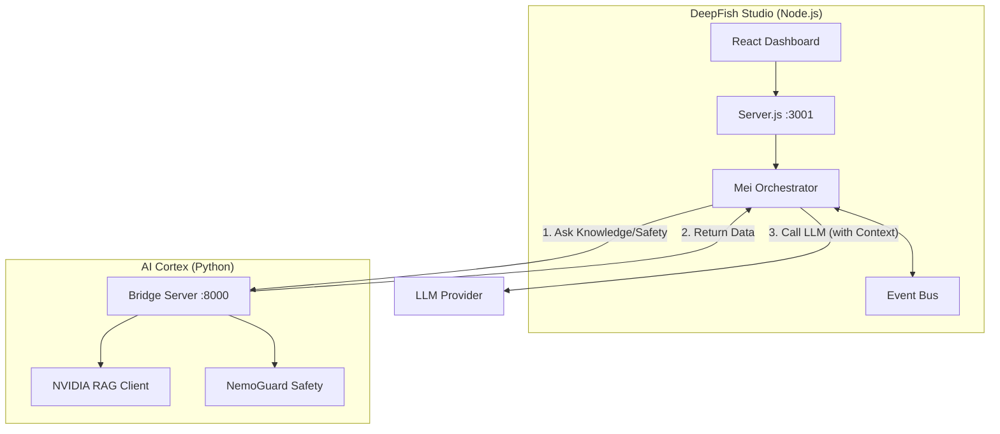

# DeepFish Hybrid Architecture

To leverage the best of both worlds—DeepFish's existing fluid Agent OS (Node.js) and NVIDIA's powerful AI tools (Python)—we have adopted a **Sidecar Architecture**.

## The "Two-Brain" System

We run two local servers that talk to each other:

1.  **The Body (Node.js)** - `localhost:3001`
    -   **Role:** Handles the "Office".
    -   **Responsibilities:** Web Dashboard, Twilio Voice calls, Agent Orchestration (Mei), Event Bus.
    -   **Why Node?** It's extremely fast for events, IO, and real-time frontend updates.

2.  **The Cortex (Python)** - `localhost:8000`
    -   **Role:** Handles the "Heavy Lifting".
    -   **Responsibilities:** Enterprise RAG (Knowledge Retrieval), NemoGuard (Safety/Security), Advanced Profiling.
    -   **Why Python?** It has first-class support for NVIDIA's AI libraries and vector math.

## How They Connect

When Mei (in Node.js) needs to "think" about a complex task or check company policy:

1.  **Node.js** pauses and sends an HTTP request to **Python** (e.g., "Get knowledge about policy X").
2.  **Python** runs the heavy NVIDIA RAG lookup and returns the text chunk.
3.  **Node.js** injects that knowledge into Mei's context and *then* calls the LLM.

## Running Locally

To start the system, you will now run:

1.  **Terminal 1:** `npm run dev` (Starts React + Node Server)
2.  **Terminal 2:** `python src/bridge_server.py` (Starts the AI Cortex)

This ensures your local development environment has the full "Enterprise" capabilities without needing a complex cloud deployment right now.
